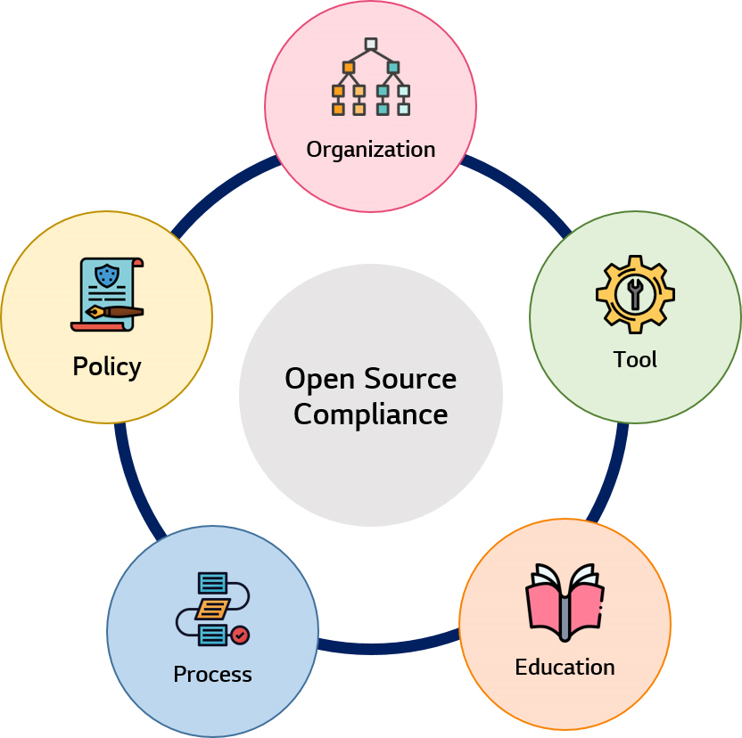

# Introduction

Using the open source when developing the software has become a must, not an option due to many benefits : shortening development periods and reducing costs. Have you ever wondered if you are using a lot of open source properly when developing in the company?

Organizations that use open source or contribute to the open source community have the necessary activities to protect their intellectual property and mitigate compliance risks. These activities are called open source compliance activities, and there are five essential elements to establish open source compliance.

<br>

### Essential components for Open Source Compliance

<p align="center"></p>

In this guide, we will introduce the each component and share useful resources. In particular, we share the LG Electronics' [open source policy](../policy/osc_policy.md) and [open source compliance process](../process/osc_process/README.md) according to [core value](https://lge-oss.github.io/about/) of LG Open Source.

1. [Organization](../organization/ospo.md)
2. [Policy](../policy/osc_policy.md)
3. [Process](../process/osc_process/README.md)
4. [Tool](../tool/osc_tool.md)
5. [Education](../education/osc_education.md)

<br>

We hope that everyone who uses and contributes to open source can keep compliance while thinking about the true value of open source by starting the release of this guide with a small seed.

All contents written in the LG Open Source Guide page is licensed under CC-BY-4.0 License.

<br>
<br>

```note
## Reference

- Linux Foundation resources : [https://www.linuxfoundation.org/resources/open-source-guides](https://www.linuxfoundation.org/resources/open-source-guides/creating-an-open-source-program/)
- OpenChain : [https://www.openchainproject.org/resources](https://www.openchainproject.org/resources)
```

<br>
