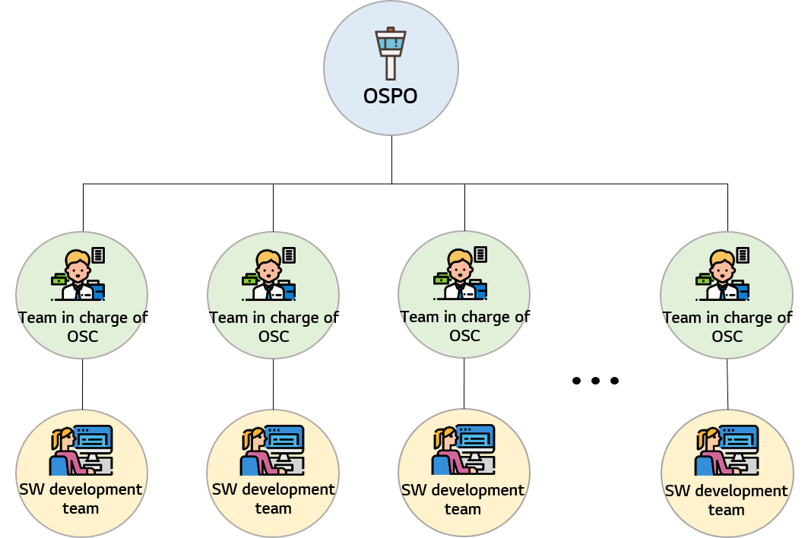

# OSPO

**OSPO** \(Open Source Program Office\) means a center organization that manages open source and reduce open source compliance ris in the company. It can play a role to build the overall open source strategy of the company such as auditing and constituting other policies on the use and distribution of open source, training for the software developers in the company, spreading an open source culture and activating participation in open source community.

 

## OSPO operating model

OSPO operates primarily on a centralized model. The SW development team in the division or project unit operates a team in charge of OSC within the department or related department.

**Team in charge of OSC** oversees the open source related tasks and perform the risk prevention activities for the open source in the **SW developement team**. 
To fulfill this role, the team in charge of OSC can guide open source compliance activities to the SW development team within the department in collaboration with OSPO.

 

