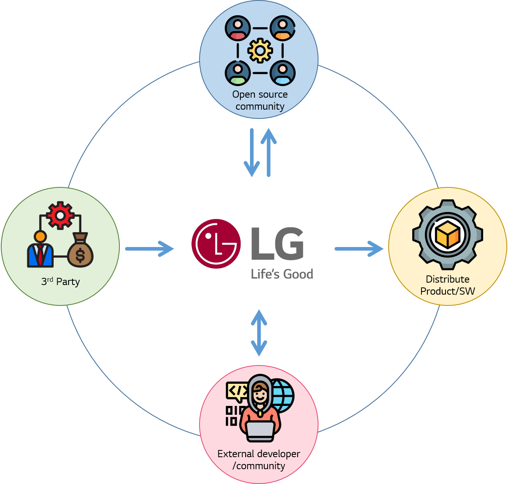

# Open Source Policy

After the [organization](../organization/ospo.md) has been configured, the next step is to establish a policy.

Open source policy is necessary to protect intellectual property and mitigate compliance risk when organizations that distribute software use or contribute to open source. 
For efficient open source compliance activities, each company needs to establish the policy that matches the software type and business type.

The following discloses how LG Electronics has established an open source policy.

 

## LG Electronics Open Source Policy

LG Electronics open source policy applies when the software developed by LGE is distributed as open source or contributed to open source communities.
All LGE divisions and R&D labs that distribute the software must comply with these policies.

LG Electronics open source policy is configured as shown in below.

<table>
  <thead>
    <tr>
      <th style="text-align:left">Policy</th>
      <th style="text-align:left">Detail</th>
    </tr>
  </thead>
  <tbody>
    <tr>
      <td style="text-align:left">
        
Open Source

        
Usage Policy

      </td>
      <td style="text-align:left">The policy to be adhered to protect LGE intellectual property and mitigate compliance risks when using open source for software to distribute or service.</td>
    </tr>
    <tr>
      <td style="text-align:left">3rd Party Software Usage Policy</td>
      <td style="text-align:left">The policy to be adhered for OSC for 3rd party software included in software that LGE distributes.</td>
    </tr>
    <tr>
      <td style="text-align:left">
        
Open Source

        
Contribution Policy

      </td>
      <td style="text-align:left">The policy to be adhered when contributing software developed by LGE to open source communities.</td>
    </tr>
    <tr>
      <td style="text-align:left">
        
External Claim

        
Response Policy

      </td>
      <td style="text-align:left">The Policy to be adhered in order to respond effectively when a claim is received from outside.</td>
    </tr>
  </tbody>
</table>
