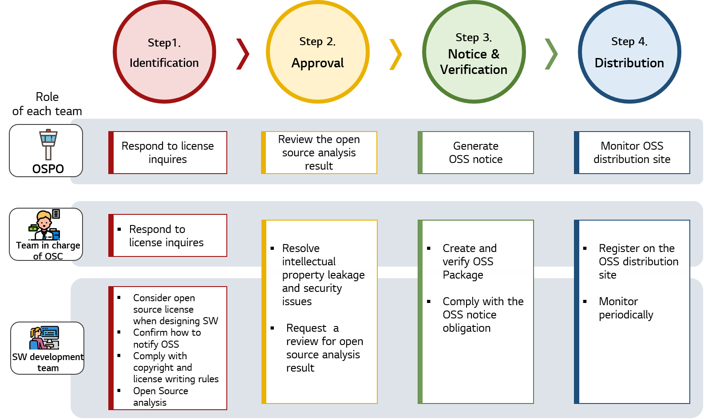

# OSC Process

If [Open Source Policy](../../policy/osc_policy.md) is established, there are activities required to comply with this. 
In order to effectively disseminate open source policy in a company, it is efficient to establish the activities and requirements for this as a process.

We disclose OSC process for open source usage policy among LG Electronics open source policy.

 

## LG Electronics OSC Process

LG Electronics OSC\(Open Source Compliance\) process provides a detailed activity guide to comply with LG Electronics open source policy. When developing software, [each team](../../organization/ospo.md) must follow the step-by-step activities required.

Step-by-step activities and requirements are as follows:

- [Step 1. Identification](1-identification.md)
- [Step 2. Approval](2-approval.md)
- [Step 3. Notice & Verification](3-notice-and-verification.md)
- [Step 4. Distribution](4-distribution.md)
