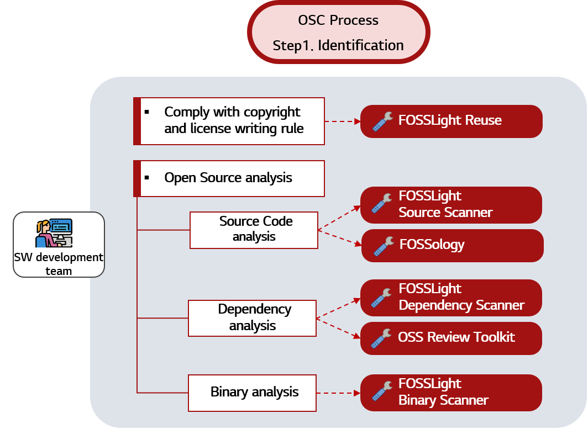

# OSC Tool

For efficient open source compliance, there are many useful tools that automatically analyze open source license on source codes, as well as tools that help manage open source for each project.
We introduce open source tools that anyone can use freely.

### Tools for OSC Process

<table>
  <thead>
    <tr>
      <th>Activities of OSC Process </th>
      <th>Tool Name</th>
      <th>Description & Guide</th>
    </tr>
  </thead>
  <tbody>
    <tr>
      <td><b>Comply with Copyright & License writing rules</b></td>
      <td><a href="https://github.com/fosslight/fosslight_reuse"><b>FOSSLight REUSE</b></a></td>
      <td>Comply with the copyright/license writing rules in the source code.
       <a href="https://fosslight.org/fosslight-guide-en/scanner/1_reuse.html">🔗Guide Link</a></td>
    </tr>
    <tr>
      <td rowspan=2><b>Source Code Analysis</b></td>
      <td><a href="https://github.com/fosslight/fosslight_source_scanner"><b>FOSSLight Source Scanner</b></a></td>
      <td>Using ScanCode, detect the copyright and license phrases contained in the file.
       <a href="https://fosslight.org/fosslight-guide-en/scanner/2_source.html">🔗Guide Link</a></td>
    </tr>
    <tr>
      <td><a href="https://www.fossology.org/"><b>FOSSology</b></a></td>
      <td>Web Service to detect Copyright and License included in the source code
       <a href="https://fossology.github.io/">🔗Guide Link</a></td>
    </tr>
    <tr>
      <td rowspan=2><b>Dependency Analysis</b></td>
      <td><a href="https://github.com/fosslight/fosslight_dependency_scanner"><b>FOSSLight Dependency Scanner</b></a></td>
      <td>When building or installing, it finds the imported dependency and detects information such as Version, License, etc. of Package
       <a href="https://fosslight.org/fosslight-guide-en/scanner/3_dependency.html">🔗Guide Link</a></td>
    </tr>
    <tr>
      <td><a href="https://oss-review-toolkit.org/"><b>OSS Review Toolkit</b></a></td>
      <td>A suite of tools to assist with reviewing Open Source Software dependencies.
       <a href="https://github.com/oss-review-toolkit/ort">🔗Guide Link</a></td>
    </tr>
    <tr>
      <td><b>Binary Analysis</b></td>
      <td><a href="https://github.com/fosslight/fosslight_binary_scanner"><b>FOSSLight Binary Scanner</b></a></td>
      <td>Searches for a binary and outputs OSS information if there is an identical or similar binary from the Binary DB.
       <a href="https://fosslight.org/fosslight-guide-en/scanner/4_binary.html">🔗Guide Link</a></td>
    </tr>
  </tbody>
</table>

 

### Open Source Management Tool

| Tool Name                                                  | Description & Guide  |                                                                         
| :---------------------------------------------------- | :----------------------------------------- |
| [👍**FOSSLight Hub**](https://fosslight.org/)             | FOSSLight Hub helps you use the open source software compliantly and securely by managing open source, license and also vulnerability. Also it can process the OSC (Open Source Compliance) process by managing BOM for each project and track issues on open source license obligations and vulnerabilities. [🔗Guide Link](https://fosslight.org/fosslight-guide)           |
| [SW360](https://www.eclipse.org/sw360/)             | SW360 provides both a web application and a repository to collect, organize and make available information about software components. [🔗Guide Link](https://github.com/eclipse/sw360)                   | 